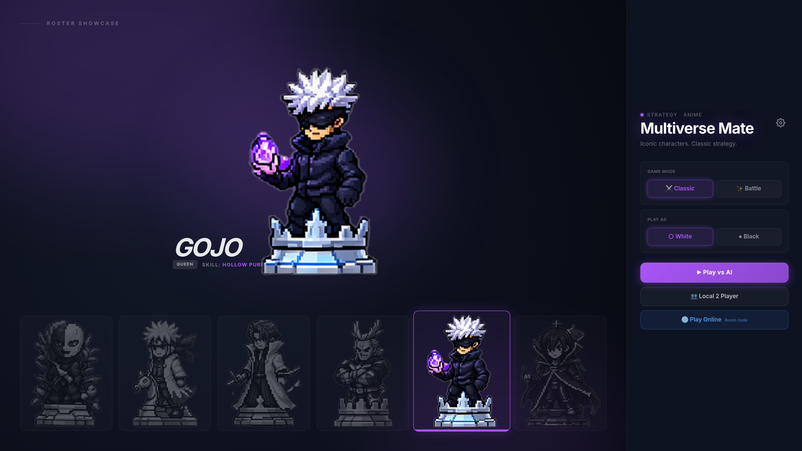

# ♟️ Multiverse Mate

<div align="center">


**Chess, but make it anime. ⚡**

*Iconic characters. Classic strategy. Epic battles.*

[🎮 Play Now](https://multiverse-mate-chess.onrender.com) • [🐛 Report Bug](https://github.com/Vijay141516/multiverse-mate/issues) • [✨ Request Feature](https://github.com/Vijay141516/multiverse-mate/issues)

</div>

---

## 🌌 What is Multiverse Mate?

**Multiverse Mate** is a full-stack anime chess game where iconic characters from **Jujutsu Kaisen, My Hero Academia, Naruto** and more become your chess pieces — each with their own **unique ability**.

Every capture triggers a **full-screen VS battle animation** like a fighting game. Every piece has a **named skill**. Every game feels like an anime showdown.

> *"Gojo Satoru is your Queen. His skill? Hollow Purple. ♟️⚡"*

---

## 📸 Screenshots



---

## ✨ Features

### 🎭 Anime Experience
- **Pixel Art Characters** — JJK, MHA, Naruto and more as chess pieces
- **VS Battle Animation** — Every capture triggers a full-screen battle cutscene between attacker and defender
- **Character Abilities** — Each piece has a unique named skill (e.g. Gojo → *Hollow Purple*)
- **Roster Showcase** — Preview all characters and their roles before the game

### 🎮 Game Modes
- **Classic Mode** — Standard chess rules with anime aesthetics
- **Battle Mode** — Enhanced gameplay variant
- **vs AI Bot** — Solo play with difficulty selection
- **Local 2 Player** — Pass-and-play on the same device
- **Online Multiplayer** — Real-time games via room code

### ⚙️ Settings & Customization
- **Board Themes** — Anime (Dark Mystic) or Classic (OG Green)
- **Accent Colors** — 6 color options (Purple, Blue, Cyan, Red, Gold, Green)
- **Player Identity** — Set your display name
- **Premoves** — Queue moves during opponent's turn like a pro

### ♟️ Chess Features
- **Chess Clock** — Per-player countdown timer
- **Move Validation** — Server-side validated moves (no cheating)
- **Real-time Sync** — Instant move updates via WebSockets
- **Mobile Friendly** — Playable on phone browsers

---

## 🛠️ Tech Stack

| Layer | Technology |
|---|---|
| Frontend | React + TypeScript |
| Backend | Node.js + TypeScript |
| Validation | Zod |
| Database | PostgreSQL |
| Real-time | WebSockets |
| Build Tool | Vite |
| Package Manager | pnpm (monorepo) |
| Deployment | Render.com |
| Dev Environment | Google Antigravity + Replit AI |

---

## 🏗️ Project Structure

```
multiverse-mate/
├── artifacts/
│   ├── anime-chess/            # React Frontend
│   │   ├── public/
│   │   │   ├── abilities/      # Ability effect assets
│   │   │   ├── pieces/         # Individual piece images
│   │   │   ├── pieces-sprite-sheet.png
│   │   │   └── pieces-white-sheet.png
│   │   └── src/
│   │       ├── components/     # UI components (Board, Piece, VSAnimation...)
│   │       ├── hooks/          # React custom hooks
│   │       ├── lib/            # Chess logic utilities
│   │       └── pages/          # Page routes
│   ├── api-server/             # Node.js Backend
│   └── mockup-sandbox/         # Prototyping area
│
├── lib/
│   ├── api-client-react/       # Typed React API hooks
│   ├── api-spec/               # Shared API contract & types
│   ├── api-zod/                # Zod validation schemas
│   └── db/                     # Database models & queries
│
├── scripts/                    # Build & utility scripts
├── render.yaml                 # Render deployment config
├── pnpm-workspace.yaml         # Monorepo workspace config
└── tsconfig.json               # TypeScript config
```

---

## 🚀 Getting Started

### Prerequisites
- Node.js 18+
- pnpm

```bash
npm install -g pnpm
```

### Installation

```bash
# Clone the repo
git clone https://github.com/Vijay141516/multiverse-mate.git
cd multiverse-mate

# Install all dependencies
pnpm install

# Start development
pnpm dev
```

### Windows
```powershell
./run.ps1
```

---

## 🎮 How to Play

1. Open [multiverse-mate-chess.onrender.com](https://multiverse-mate-chess.onrender.com)
2. Browse the **Roster Showcase** — see all anime characters and their chess roles
3. Pick a **Game Mode** — Classic or Battle
4. Choose **Play As** — White or Black
5. Select how you want to play:
   - **Play vs AI** — solo against the bot
   - **Local 2 Player** — same device with a friend
   - **Play Online** — enter a room code to challenge anyone
6. Tap a piece to select, tap a square to move
7. When you capture a piece → **VS battle animation plays** ⚡
8. Activate your piece's **special ability** once per game
9. Checkmate the opponent's King to win ♟️

---

## ⚙️ Customization

| Setting | Options |
|---|---|
| Board Theme | Anime (Dark Mystic) / Classic (OG Green) |
| Accent Color | Purple / Blue / Cyan / Red / Gold / Green |
| Premoves | On / Off |
| Player Identity | Custom name |

---

## 🤖 Built With AI Agents

This project was built using a **multi-agent AI workflow**:

- **Google Antigravity** — VS Code-based agentic IDE with Gemini 3.1 Pro + Claude built in. Used Manager view to spawn multiple parallel agents working simultaneously across frontend, backend, API layer and database.
- **Replit AI** — Used for running, testing and iterating

Using AI agents to build is itself a modern development skill. The vision, product decisions, character concepts, and architecture direction were all human-driven.

---

## 🙏 Acknowledgements

- Anime pixel art sprites for the chess pieces
- [chess.js](https://github.com/jhlywa/chess.js) for chess move validation
- Google Antigravity & Replit AI for agentic development
- Render.com for free hosting

---

## 📄 License

MIT License — feel free to fork and build your own anime chess variant!

---

<div align="center">

Made with ♟️ + ⚡ by [Vijay141516](https://github.com/Vijay141516)

⭐ **Star this repo if you think it's cool!**

*"A BCA student built this. What's your excuse?"* 😄

</div>
